# UML / diagrams (Mermaid — render on GitHub or any Mermaid viewer)

All diagrams show classes that exist in `include/`.

## 1. Use cases

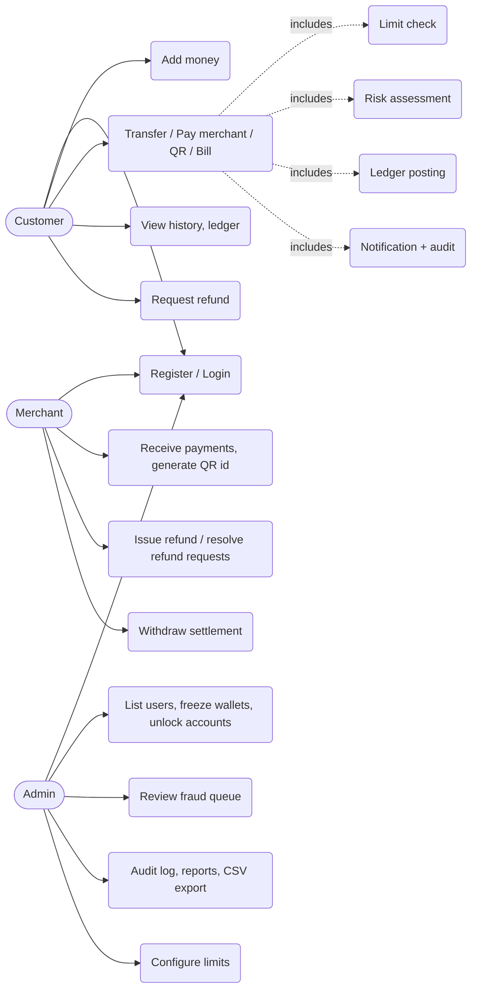

## 2. Architecture

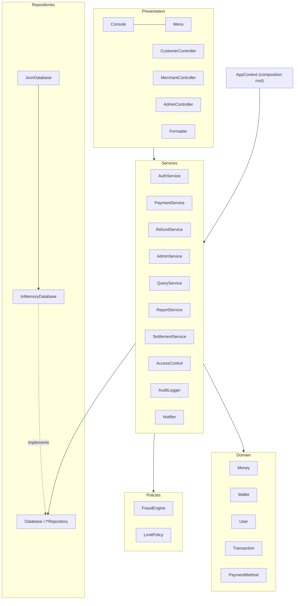

## 3. Core domain classes

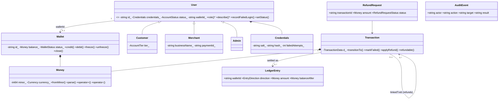

## 4. Payment processing

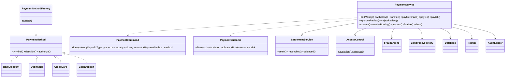

## 5. Transfer sequence

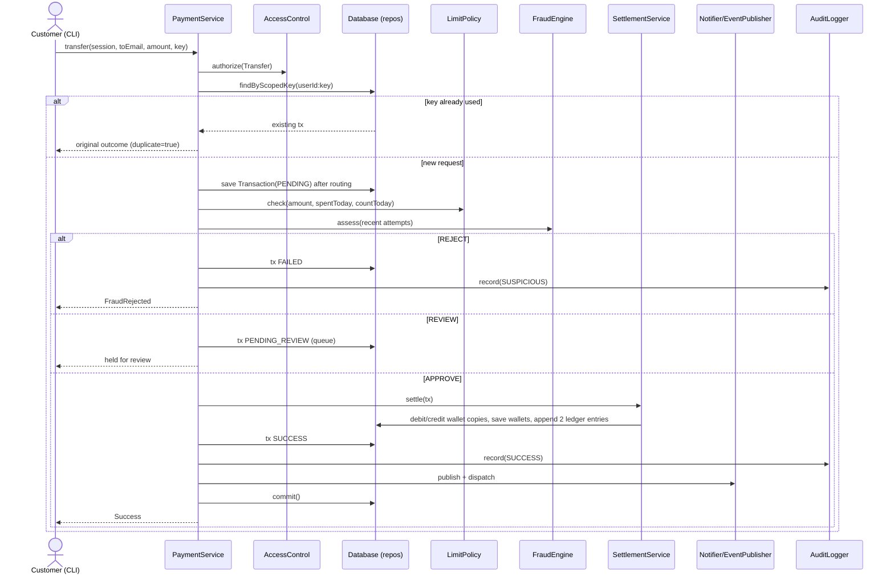

## 6. Merchant payment + refund sequence

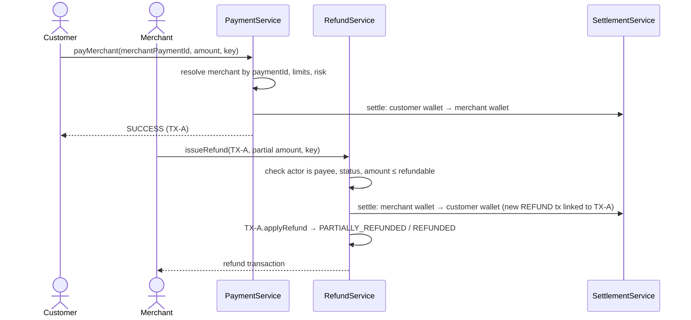

## 7. Transaction lifecycle

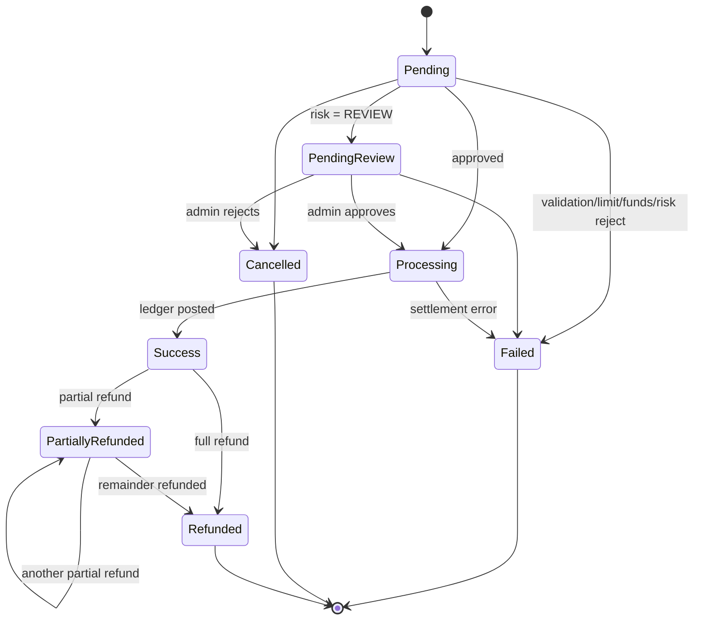

## 8. Fraud / risk engine

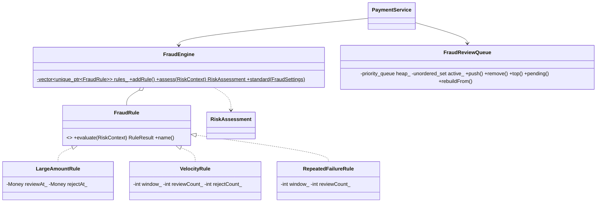

## 9. Notification system

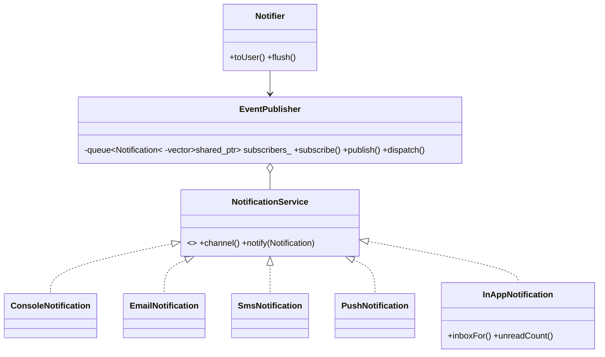

## 10. Repository architecture

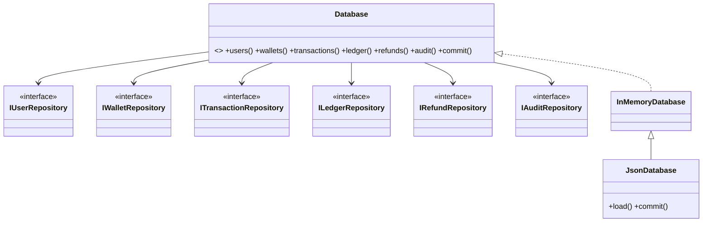

## Simplified diagram for reports / viva

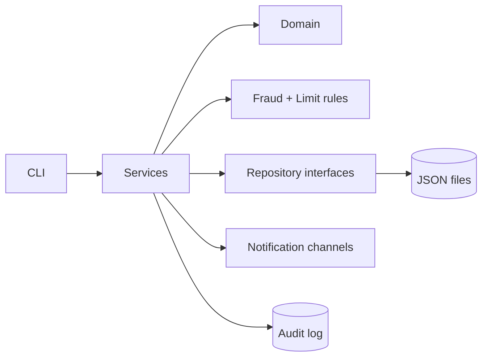
